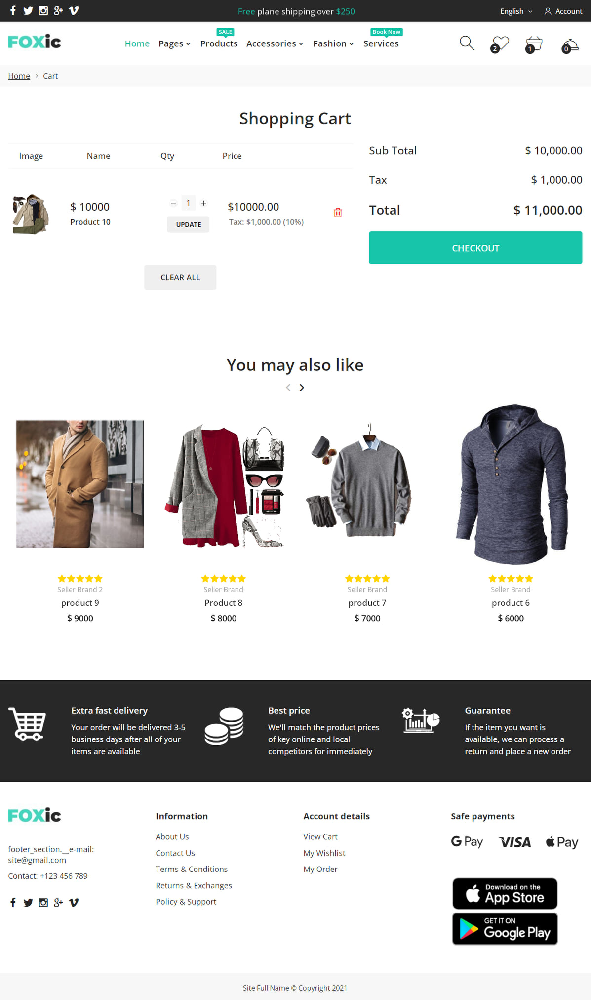
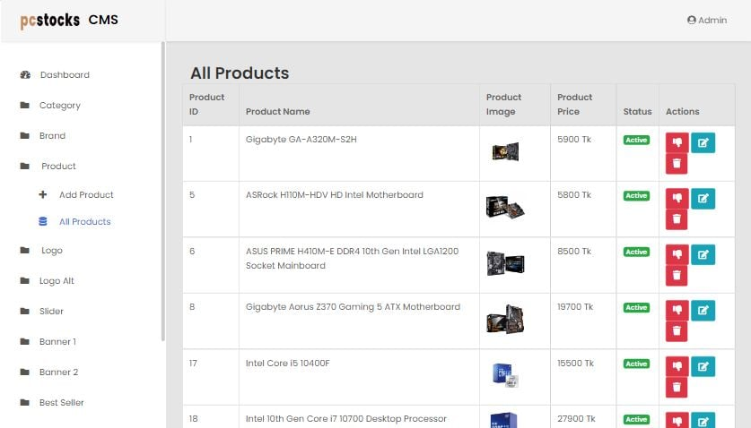

<h1>Recent Project Work:</h1>
<h3>E-commererce Website – Martfury</h3>

Martfury E-commerce website developed and customized by PHP, Laravel. It's a product of Botble with custom plugins and features with some custom API integration. It’s a multi-vendor e-commerce project.

 

Image 1: Home Page

  

Image 2: Product Filter Page

  

Image 3: Product Details Page

  

Image 4: Shopping Cart

  

Image 5: Checkout Page

  

Image 6: Order Confirmation

  

Image 7: Success and Pending Order Page

  
  

<h3>E-commererce Website – Foxic</h3>

Foxic E-commerce website developed by PHP, Laravel in back-end development & Ajax in front-end. It’s a multi-vendor e-commerce project.

 

Image 1: Home Page

  

Image 2: Product Details Page

  

Image 3: Product Filter Page

  

Image 4: Search Page

  

Image 5: Wishlist Page

  

Image 6: Seller Brand Product Page

  

Image 7: Collection Page

  

Image 8: Site Blog Page

  

Image 9: Shopping Cart Page

  

Image 10: Customer Registration and Login Page

  

Image 11: Customer Dashboard

  

Image 12: Checkout Payment Page

  

Image 13: Invoice Page

  

Image 14: Success Order Page

  

Image 15: Customer Messenger Page

  
  

<h3>E-commerce Website – Wolmart</h3>

Wolmart E-commerce website developed by PHP, Laravel in back-end development & Ajax in front-end. It was a multi-vendor e-commerce project. It was added several services like Pusher notification & live chat, Firebase OTP authentication and more services related transaction service.

 

Image 1: Home Page

  

Image 2: Product Filter Page

  

Image 3: Product Details Page

  

Image 4: Shopping Cart Page

  

Image 5: Customer Login Page

  

Image 6: Checkout Payment Page

  

Image 7: Order Confirmation Invoice Page

  
  

<h3>Business Website – Aquagreen</h3>

Drinking mineral water and accessories supplier website developed by PHP, Laravel, Bootstrap.

 

Image 1: Home Page

  

Image 2: Admin Dashboard

  
  

<h3>Enroll Course Website – Eudica</h3>

Enroll course website where students can enroll courses related learning new skills and education and 
course instructors can upload their courses. It was developed by PHP, Laravel, MySQL, Bootstrap, Ajax, 
Integrated API, Pusher notification and live chat. Student can get certificate on the base of course 
completion. The courses are well organized by category, sub category and sub sub sub category and 
the courses page was developed by a strong filter. Courses can be searched by course name, categories 
and instructors. Student can purchase courses through cart system.

 

Image 1: Home Page

  

Image 2: Course Filter Page

  

Image 3: Search Page

  

Image 4: Course Details Page

  

Image 5: Student Profile Page

  

Image 6: My Favorite Course Page

  

Image 7: Cart Page

  

Image 8: Checkout Payment Page

  

Image 9: Order Confirmation Page

  

Image 10: My Course Page

  

Image 11: Course Purchase History Page

  

Image 12: Site Blog Page

  

Image 13: Blog Details Page

  

Image 14: Instructor Uploaded Course Page

  

Image 15: Admin Dashboard

  
  

<h3>Business Website – Pcstocks</h3>

Computer accessories business website developed by PHP, Laravel, Bootstrap. 

 

Image 1: Home Page

  

Image 2: Shop Page

  

Image 3: About Page

  

Image 4: Customer Register Page

  

Image 5: Admin Login Page

  

Image 6: Product Upload Page

  

Image 7: All Products Page

  

Image 8: Point Of Sale Page

  

Image 9:  Database

  

Image 10: Admin Dashboard

  

